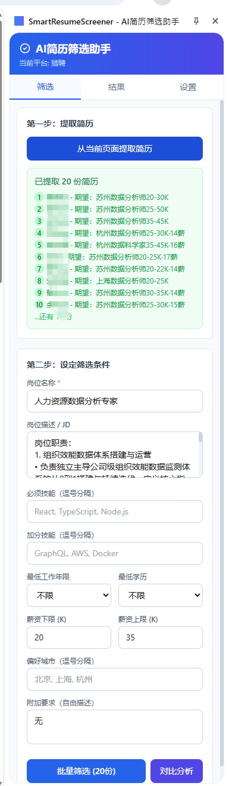
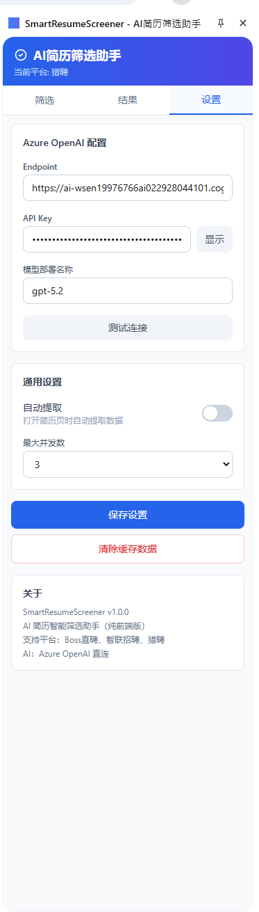

# SmartResumeScreener — AI 简历智能筛选助手

> 一个基于 **Azure OpenAI** 的 Chrome 浏览器插件，帮助 HR 在 **Boss直聘**、**智联招聘** 和 **猎聘** 上高效、智能地筛选候选人简历。
>
> **纯前端架构** — 无需部署后端服务，扩展直接调用 Azure OpenAI API。

---

## 项目架构

```
SmartResumeScreener/
└── extension/                        # Chrome Extension (Manifest V3)
    ├── src/
    │   ├── shared/                   # 公共模块
    │   │   ├── types.ts              # TypeScript 类型定义
    │   │   ├── ai-service.ts         # Azure OpenAI 直调服务 (Prompt Builder + API + 解析)
    │   │   └── storage.ts            # Chrome Storage 封装
    │   ├── content/                  # 内容脚本 (Strategy Pattern)
    │   │   ├── boss.ts               # Boss直聘 提取器
    │   │   ├── zhaopin.ts            # 智联招聘 提取器
    │   │   └── liepin.ts             # 猎聘 提取器
    │   ├── background/               # Service Worker (Observer Pattern)
    │   │   └── index.ts              # 消息路由 & AI 调用调度
    │   ├── popup/                    # 弹窗 UI (React)
    │   │   └── Popup.tsx
    │   └── sidepanel/                # 侧边栏 UI (React)
    │       ├── SidePanel.tsx
    │       └── components/
    │           ├── CriteriaForm.tsx   # 筛选条件表单
    │           ├── ResultCard.tsx     # 评分结果卡片
    │           ├── ComparisonReport.tsx # 候选人对比报告
    │           └── SettingsPanel.tsx  # Azure OpenAI 配置面板
    ├── icons/                        # 扩展图标
    ├── manifest.json                 # 源 manifest（开发参考）
    ├── manifest.dist.json            # 构建用 manifest（自动复制到 dist）
    └── dist/                         # 构建产物 → 加载到 Chrome
```

## 设计模式

| 模式 | 应用场景 | 文件 |
|------|----------|------|
| **Strategy** | 不同招聘平台的简历提取逻辑可互换 | `boss.ts`, `zhaopin.ts`, `liepin.ts` |
| **Builder** | 构建结构化 AI 评估提示词 | `ai-service.ts` 内 `buildScreeningPrompt()` |
| **Facade** | 封装 Azure OpenAI REST API 调用细节 | `ai-service.ts` |
| **Observer** | Chrome 消息传递：内容脚本 ↔ Background ↔ UI | `background/index.ts` |

---

## UI 预览

<table>
  <tr>
    <td align="center"><b>筛选面板</b></td>
    <td align="center"><b>设置面板</b></td>
  </tr>
  <tr>
    <td></td>
    <td></td>
  </tr>
  <tr>
    <td>从招聘平台一键提取简历，设定岗位要求、技能、薪资等筛选条件，支持批量 AI 评分和多人对比分析。</td>
    <td>配置 Azure OpenAI Endpoint、API Key 和模型部署名称，支持连接测试、自动提取和并发数调节。</td>
  </tr>
</table>

---

## 快速开始

### 前置要求

- [Node.js 18+](https://nodejs.org/)
- Google Chrome 浏览器
- Azure OpenAI 服务（已部署 Chat 模型，如 GPT-4o / GPT-5.2）

### 1. 构建 Chrome 扩展

```bash
cd extension

# 安装依赖
npm install

# 构建（TypeScript 检查 + Vite 打包 + 复制 manifest & 图标）
npm run build
```

### 2. 加载扩展到 Chrome

1. 打开 Chrome，导航到 `chrome://extensions/`
2. 开启右上角 **开发者模式**
3. 点击 **加载已解压的扩展程序**
4. 选择 `extension/dist` 文件夹
5. 扩展图标出现在工具栏中

### 3. 配置 Azure OpenAI

1. 在任意支持的招聘平台页面点击扩展图标 → 打开侧边栏
2. 切换到 **设置** 标签页
3. 填入：
   - **Endpoint**：你的 Azure OpenAI 终端地址（如 `https://xxx.openai.azure.com`）
   - **API Key**：对应的 API 密钥
   - **模型部署名称**：部署的模型名称（如 `gpt-5.2`）
4. 点击「测试连接」验证配置 → 保存设置

---

## 使用流程

```
                    ┌─────────────┐
                    │  HR 打开     │
                    │ Boss直聘 /   │
                    │ 智联招聘 /   │
                    │ 猎聘        │
                    └──────┬──────┘
                           │
                    ┌──────▼──────┐
                    │ Content Script│
                    │ 自动检测平台  │
                    │ 注入提取器    │
                    └──────┬──────┘
                           │
                    ┌──────▼──────┐
                    │ 点击扩展图标  │
                    │ 打开侧边栏   │
                    └──────┬──────┘
                           │
              ┌────────────▼────────────┐
              │ 1. 点击「提取简历」       │
              │    从页面抓取候选人信息    │
              └────────────┬────────────┘
                           │
              ┌────────────▼────────────┐
              │ 2. 填写筛选条件          │
              │    (岗位要求、技能、经验)  │
              └────────────┬────────────┘
                           │
              ┌────────────▼────────────┐
              │ 3. AI 智能评分           │
              │    直接调用 Azure OpenAI  │
              │    无需后端中转           │
              └────────────┬────────────┘
                           │
              ┌────────────▼────────────┐
              │ 4. 查看结果              │
              │    - 综合评分 (0-100)    │
              │    - 推荐等级             │
              │    - 四维评分（技能/经验/  │
              │      学历/综合素质）       │
              │    - 优势 & 风险点        │
              │    - 建议面试问题         │
              └─────────────────────────┘
```

### 功能亮点

- **单人筛选**：在候选人简历页面一键 AI 评分
- **批量筛选**：在候选人列表页批量提取 & 评分（并发控制，避免限流）
- **多人对比**：将多位候选人放在一起，生成 AI 对比报告（Markdown 表格）
- **条件保存**：筛选条件自动保存到 Chrome Storage，下次无需重填
- **结果缓存**：筛选结果本地缓存（最近 100 条），支持离线查看
- **纯前端**：无需部署后端，API Key 安全存储在本地 Chrome Storage

---

## AI 评估维度

| 维度 | 权重 | 说明 |
|------|------|------|
| 技能匹配度 | 35% | 候选人技能与岗位要求的契合程度 |
| 经验相关性 | 30% | 工作经历与岗位的相关性 |
| 教育背景 | 15% | 学历是否达标以及专业相关性 |
| 综合素质 | 20% | 基于自我评价、项目经历等判断软实力 |

### 推荐等级

| 评分范围 | 推荐等级 |
|----------|----------|
| 80-100 | 🟢 强烈推荐 (StronglyRecommended) |
| 60-79 | 🔵 推荐 (Recommended) |
| 40-59 | 🟡 待定 (MaybeConsider) |
| 0-39 | 🔴 不推荐 (NotRecommended) |

---

## 开发指南

### 扩展开发

```bash
cd extension
npm run dev         # Vite watch 模式，文件变化自动重新构建
```

修改代码后，在 `chrome://extensions/` 页面点击扩展的 **刷新** 按钮即可更新。

### 新增平台支持

1. 在 `src/content/` 下创建新的提取器（参考 `boss.ts`）
2. 在 `manifest.dist.json` 和 `manifest.json` 中添加对应的 `content_scripts` 和 `host_permissions`
3. 在 `vite.config.ts` 的 `rollupOptions.input` 中添加新入口
4. 在 `Popup.tsx` 的平台检测逻辑中添加新域名

---

## 技术栈

| 组件 | 技术 |
|------|------|
| AI 服务 | Azure OpenAI REST API (GPT) |
| 扩展框架 | Chrome Extension Manifest V3 |
| 前端框架 | React 18 + TypeScript 5 |
| 构建工具 | Vite 5 |
| 样式 | Tailwind CSS 3 |
| 数据存储 | Chrome Storage API |

---

## 支持平台

| 平台 | 域名 | 功能 |
|------|------|------|
| Boss直聘 | `zhipin.com` | 简历提取 & AI 筛选 |
| 智联招聘 | `zhaopin.com` | 简历提取 & AI 筛选 |
| 猎聘 | `liepin.com` | 简历提取 & AI 筛选 |

---

## 许可证

MIT License
